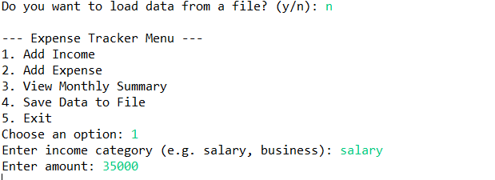
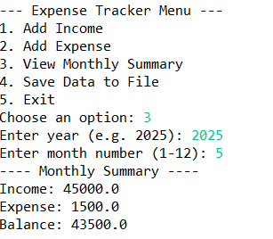
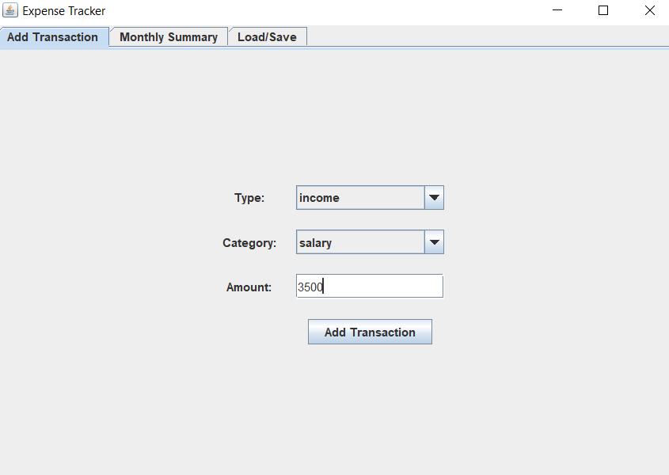
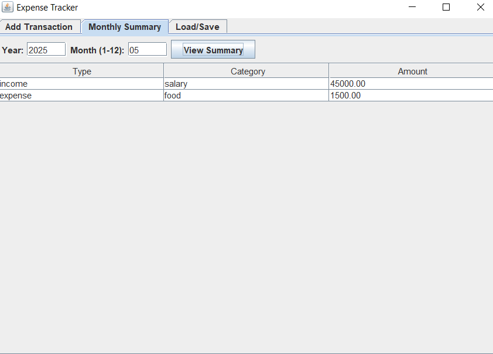
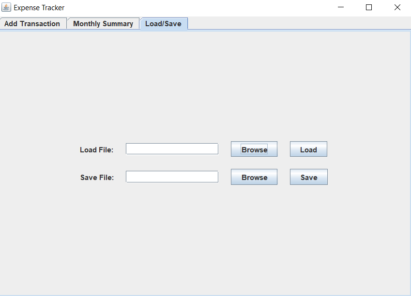

# 📊 Expense Tracker Application

This project is a **personal finance tracker** that allows you to:
- Add income and expenses
- View monthly summaries
- Save/load transactions to/from Excel
- Store data into MySQL database
- Choose between a **Swing-based GUI app** or a **console-based CLI app**

---

## 🔧 Technologies Used

- Java 8+
- Swing (for GUI)
- Apache POI (for Excel file read/write)
- MySQL (for database storage)
- Maven

---

## 🖥️ Application Modes

### 1. 🪟 ExpenseTrackerSwingApp (Graphical User Interface)

#### ✅ Features
- Add income/expense with type, category, and amount.
- Reset fields after adding transactions.
- View monthly summary (grouped by type & category).
- Load/save data from/to Excel file.
- File browser for selecting files easily.

#### ▶️ Run Instructions
```
# Compile and run with Maven
mvn compile
mvn exec:java -Dexec.mainClass="com.expense.main.ExpenseTrackerSwingApp"
```

#### 📝 Notes
- You can load/save Excel files using the "Load/Save" tab.
- Use the "Browse" buttons to select files from your system.
- Summary is shown by year and month.

---

### 2. 🖥️ ExpenseTrackerApp (Console-based Application)

#### ✅ Features
- Command-line interface to add transactions
- View summary by month
- Save/load to Excel
- Store/retrieve transactions from MySQL database

#### ▶️ Run Instructions
```
# Compile and run
mvn compile
mvn exec:java -Dexec.mainClass="com.expense.main.ExpenseTrackerApp"
```

#### 🧠 Sample CLI Actions:
- Enter `1` → Add Transaction
- Enter `2` → View Summary
- Enter `3` → Load from Excel
- Enter `4` → Save to Excel
- Enter `5` → Save to DB
- Enter `6` → Load from DB
- Enter `0` → Exit

---

## 📁 Excel Format

| Type    | Category | Amount | Date       |
|---------|----------|--------|------------|
| income  | salary   | 15000  | 2024-05-10 |
| expense | food     | 500    | 2024-05-11 |

---

## 🗃️ MySQL Database Setup

```sql
CREATE DATABASE expense_tracker;

USE expense_tracker;

CREATE TABLE transactions (
    id INT AUTO_INCREMENT PRIMARY KEY,
    type VARCHAR(20),
    category VARCHAR(50),
    amount DOUBLE,
    date DATE
);
```

Update your DB credentials in `TransactionManager.java`:
```java
private static final String URL = "jdbc:mysql://localhost:3306/expense_tracker";
private static final String USER = "root";
private static final String PASSWORD = "your_password";
```

---

## 📦 Maven Dependencies (in `pom.xml`)

```xml
<dependencies>
  <dependency>
    <groupId>mysql</groupId>
    <artifactId>mysql-connector-j</artifactId>
    <version>8.0.33</version>
  </dependency>
  <dependency>
    <groupId>org.apache.poi</groupId>
    <artifactId>poi-ooxml</artifactId>
    <version>5.2.3</version>
  </dependency>
</dependencies>
```

## 🖼️ Screenshots

### Console-Based Application (`ExpenseTrackerApp`)
#### Add Income/Expense


#### Monthly Summary


---

### GUI Application (`ExpenseTrackerSwingApp`)
#### Add Transaction


#### Monthly Summary


#### Load/Save



---

## 📌 Future Improvements
- Add login/user management
- Export summary reports as PDFs
- Schedule recurring expenses
- Chart visualizations (pie/bar charts)
